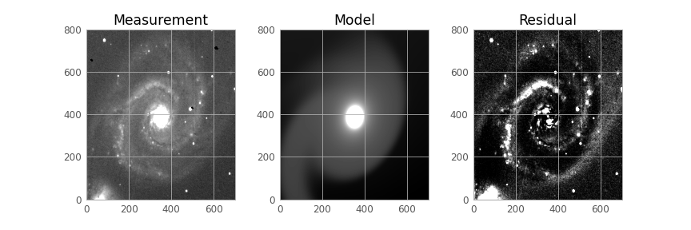

# Galaxy Morphology Analysis using Sersic Profile Fitting

This repo contains an observational astrophysics project on galaxy classification using the Planewave CDK20 telescope and Sersic profile fitting with GalFit.

## Methodology

This project investigates the morphology of three galaxies using observational data from the HPP (Planewave CDK20) telescope. The workflow spans from raw data reduction to 2D profile fitting using GalFit, allowing structural classification through Sersic profile decomposition.

### Observations
- Targets: M81 (Bode Galaxy), M51 (Whirlpool Galaxy), M49 (elliptical galaxy)
- Filter: Johnson R-band
- Integration time: 20 minutes per galaxy
- Reference stars for photometric calibration:
  - M81: HD 85-458
  - M51: TYC 3463-58-1
  - M49: Denebola (HR 4534)

### Data Reduction
- Dark Subtraction: Remove camera electronic noise using median dark frames
- Flat Fielding: Correct uneven illumination with twilight flats
- Cosmic Ray Rejection: `astroscrappy` using L.A.Cosmic algorithm
- Background Subtraction: Mean background removal for each science frame
- Astrometric Calibration: Using astrometry.net
- Stacking: Aligning and averaging 20 exposures per galaxy via `astroalign`
- Photometric Calibration: Using standard stars to derive a magnitude zeropoint

### Profile Fitting with GalFit

GalFit fits 2D Sersic profiles to the reduced galaxy images:

Sersic profile equation:  
Σ(r) = Σₑ · exp{ -κ · [ (r / rₑ)^(1/n) - 1 ] }

Where:  
- Σₑ: surface brightness at the effective radius  
- rₑ: effective (half-light) radius  
- n: Sersic index (morphology indicator)  
  - n ≈ 1 → exponential disk (spirals)  
  - n ≈ 4 → de Vaucouleurs profile (ellipticals)

### Results Summary
- M51 (Whirlpool): Modeled with 4 components; spiral arms and bulge well captured
- M81 (Bode): 2 components; spiral arms partially unresolved due to core dominance
- M49: 3 components; expected elliptical profile not fully recovered (fitted indices too low)

### Output
Each galaxy includes:
- Reduced FITS science image
- GalFit `.feedme` config and output
- Plots: input image, model, and residual
- Tables of derived parameters: integrated magnitude, effective radius, Sersic index

## Structure
- `notebooks/`: Image processing, stacking, PSF creation
- `galfit/`: Feedme configs + model results
- `data/`: Raw FITS images + PSFs
- `figs/`: Final output images and plots
- `extras/`: GALFIT example/reference material
- `report/`: Report explaining the experiment

## Tools
Python (Astroalign, AstroScrappy), GalFit, Astrometry.net, Jupyter

## License
MIT — see `LICENSE`.